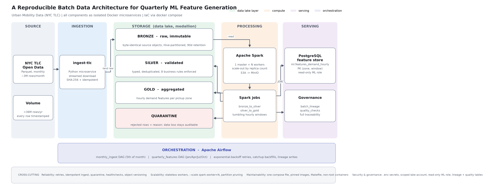

# A Reproducible Batch Data Architecture for Quarterly ML Feature Generation on Urban Mobility Data

Portfolio project for **Data Engineering (DLMDSEDE02)** — Task 1,
batch-processing data architecture.

The system is the backend for a demand-forecasting model that retrains once
per quarter. It ingests NYC TLC yellow taxi trip records monthly, validates
and conforms them, aggregates a quarter of trips into hourly features per
pickup zone, and serves the result to the machine learning application. The
model itself is explicitly out of scope.



## Design at a glance

| Concern | Component | Notes |
|---|---|---|
| Ingestion | `ingest-tlc` (Python) | streamed download, SHA-256 provenance, idempotent |
| Data lake | MinIO | S3-compatible; bronze / silver / gold / quarantine |
| Processing | Apache Spark 3.5 | 1 master + N stateless workers |
| Orchestration | Apache Airflow 2.9 | monthly ingest DAG, quarterly feature DAG |
| Serving | PostgreSQL 16 | `ml.features_demand_hourly`, read-only consumer role |
| IaC | `docker-compose.yml` + `Makefile` | one command rebuilds the platform |

**Data:** NYC TLC Yellow Taxi trips — ~3 million timestamped rows per month,
over 36 million per year, comfortably above the 1,000,000-row requirement.

## Prerequisites

- Docker Desktop with the WSL2 backend (Windows) or Docker Engine (Linux/macOS)
- ~8 GB RAM available to Docker, ~20 GB disk for a year of trip data

## Run it on a Mac

Works on both Apple Silicon and Intel: every image is published for `arm64`
and `amd64`, and the Airflow image resolves `JAVA_HOME` per architecture.

1. Docker Desktop → **Settings → Resources** → Memory at least **10 GB**
   (8 GB if you use `make up-lite`).
2. Then:

```bash
git clone https://github.com/ashutosh22102/de-batch-platform-nyc-taxi.git
```

```bash
cd de-batch-platform-nyc-taxi && make up
```

```bash
make smoke
```

On a 16 GB Mac use `make up-lite` instead of `make up`. The interfaces open
directly at `http://127.0.0.1:8080` (Airflow), `:9001` (MinIO), `:8081` (Spark).
If `make` is missing, run `xcode-select --install` once.

## Run it in the cloud (no local install)

Nothing needs installing on Windows. Open the repository in **GitHub
Codespaces** (green *Code* button, *Codespaces*, *Create codespace on main*).
The devcontainer provisions Docker automatically, then:

```bash
make up-lite
```

```bash
make smoke
```

The **PORTS** tab exposes Airflow (8080), MinIO (9001) and Spark (8081) as
browser URLs. `up-lite` applies `docker-compose.lite.yml`, which trims the
resource limits and runs a single Spark worker so the platform fits a 16 GB
cloud machine; the architecture is unchanged, since worker count is a replica
setting.

## Quick start

One command on a machine with Docker. Credentials are generated, images are
built, all nine services start, and the command blocks until every one of them
reports healthy. Nothing has to be edited by hand and nothing has to be
clicked in a user interface.

```bash
make up
```

Then verify the whole pipeline end to end -- ingest a month, validate it,
aggregate the quarter, and print what reached the feature store:

```bash
make smoke
```

| Service | URL |
|---|---|
| Airflow | http://127.0.0.1:8080 (login `admin`, password printed by `make up`) |
| MinIO console | http://127.0.0.1:9001 |
| Spark master | http://127.0.0.1:8081 |
| Warehouse | no host port; `docker compose exec warehouse psql -U warehouse -d features` |

Both DAGs start unpaused, so the schedules run without intervention. To load a
full year and build a quarter explicitly:

```bash
make backfill
```

```bash
make quarter Q=2024Q1
```

## Specification files

Everything needed to rebuild the platform is declared in these files; nothing
is configured by hand.

| File | Specifies |
|---|---|
| `docker-compose.yml` | The nine services, network, volumes, ports, health checks, hardening, resource limits |
| `docker-compose.lite.yml` | Reduced limits and a single worker for 16 GB / cloud machines |
| `spark/Dockerfile` | The processing image: base image, S3A and JDBC jars, user entry |
| `airflow/Dockerfile` | The orchestration image: base image, Java runtime |
| `airflow/requirements.txt` | Pinned Python dependencies of the orchestration image |
| `requirements-dev.txt` | Pinned host-side dependencies for verification scripts and the diagram |
| `.env.example` | Every configuration variable; `make init` generates `.env` from it |
| `serving/init.sql` | Feature store and governance schemas, read-only consumer role |
| `serving/bootstrap.sh` | Lake zones, versioning, retention lock, scoped service account |
| `.devcontainer/devcontainer.json` | The cloud development environment (GitHub Codespaces) |
| `Makefile` | Every operational command |

## Repository layout

```
airflow/dags/monthly_ingest.py      monthly: land raw data, then validate
airflow/dags/quarterly_features.py  quarterly: aggregate, verify, record lineage
ingestion/ingest_tlc.py             source -> bronze
spark/jobs/bronze_to_silver.py      validation, 8 business rules, quarantine
spark/jobs/silver_to_gold.py        hourly tumbling-window aggregation
serving/init.sql                    feature store + governance schema
serving/bootstrap.sh                lake buckets + scoped service account
docs/make_architecture_diagram.py   regenerates docs/architecture.png
docs/phase1_concept.md              Phase 1 concept text and justifications
```

## How the requirements are met

**Reliability** — exponential-backoff retries in Airflow; idempotent
ingestion guarded by `head_object`; rejected rows quarantined with a named
reason rather than silently dropped; healthchecks with ordered startup;
MinIO object versioning for recovery.

**Scalability** — stateless Spark workers scale with
`docker compose up -d --scale spark-worker=4`; Hive-style partitioning lets
Spark prune directories instead of scanning the lake; the serving table is
indexed on the window column.

**Maintainability** — a single compose file, exactly pinned image tags, a
Makefile as the only entry point, and one shared Spark session builder.

**Security, governance, protection** — no service binds `0.0.0.0`: operator
UIs are on `127.0.0.1` and the data stores publish no host port at all. Every
container runs `no-new-privileges` with all Linux capabilities dropped (the
databases keep only the five `initdb` needs) and CPU/memory limits. Secrets
come from a git-ignored `.env`; the pipeline uses a scoped MinIO service
account, never root; the ML consumer has a `SELECT`-only role.
`governance.batch_lineage` and `governance.quality_checks` make every batch
traceable. Full trust-boundary analysis in [docs/security.md](docs/security.md);
verify with `make scan` and `make secrets-check`.

## Regenerating the architecture diagram

```bash
python docs/make_architecture_diagram.py
```

The diagram is generated from code, so it is version-controlled and
reproducible like the rest of the platform.
